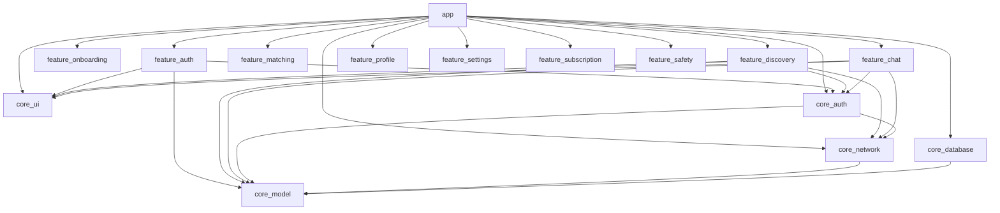
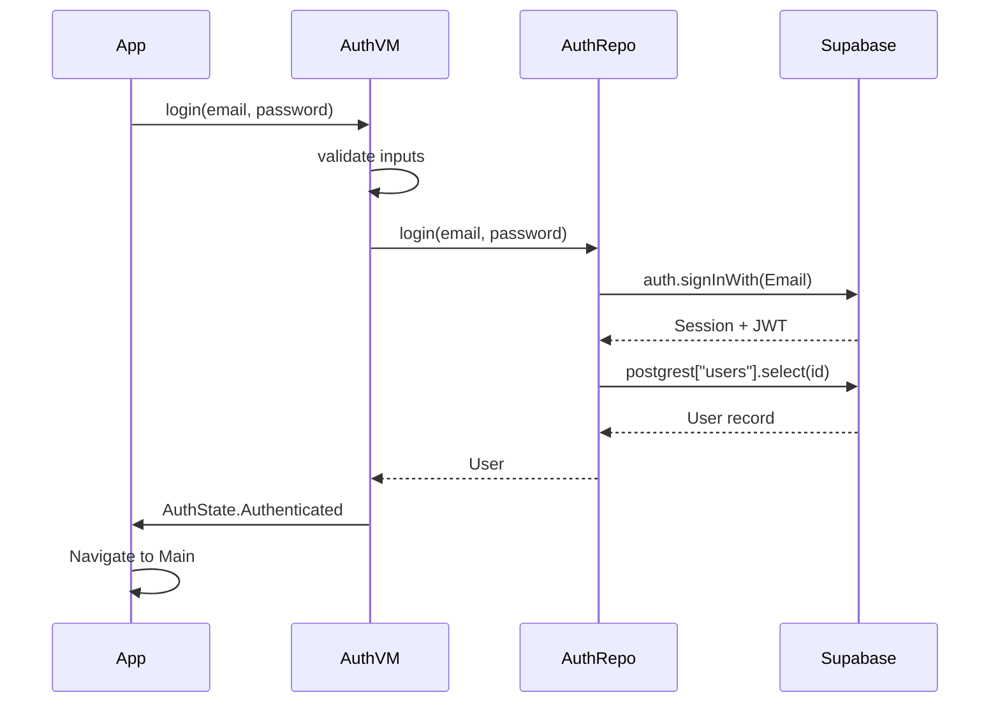
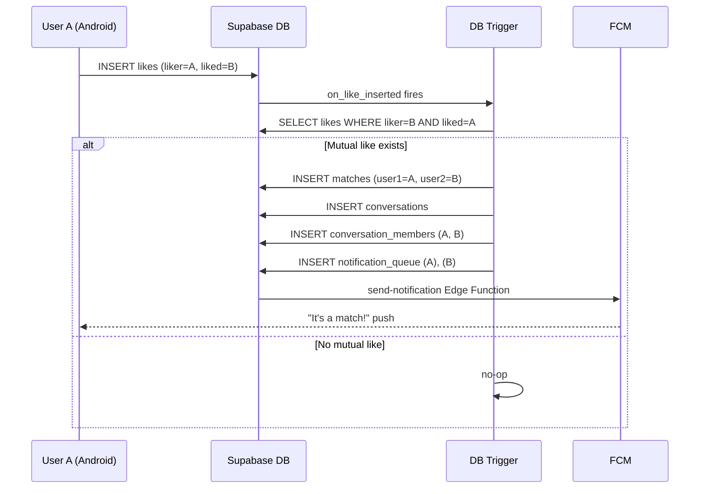
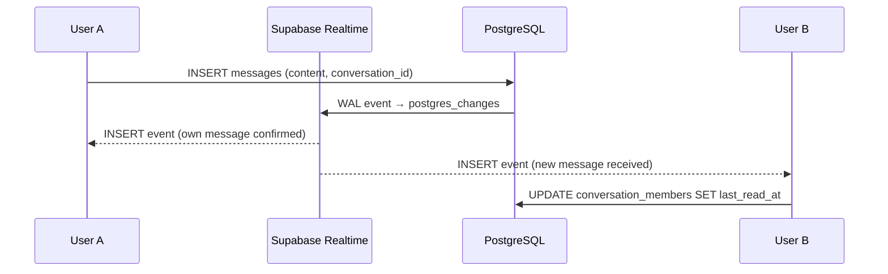

# Architecture

## Overview

Spark follows Clean Architecture with three layers — UI, Domain, and Data — enforced via the Android multi-module structure. Feature modules depend on core modules; core modules never depend on feature modules.

```
┌──────────────────────────────────────────────────────┐
│                    app module                        │
│  (navigation, DI wiring, MainActivity, Application)  │
└────────────────────────┬─────────────────────────────┘
                         │ depends on
          ┌──────────────┼──────────────┐
          ▼              ▼              ▼
    feature:auth   feature:discovery  feature:chat  …
          │              │              │
          └──────┬────────┘──────────────┘
                 ▼
         core:ui  core:auth  core:network  core:database  core:model
```

## Data flow

```
Composable
  └─ observes StateFlow
       └─ ViewModel (Hilt @HiltViewModel)
            └─ Repository (injected interface)
                 └─ Supabase SDK (PostgREST / Realtime / Storage)
                      └─ PostgreSQL (Supabase managed)
```

## Module dependency graph



## Authentication flow



## Match creation flow



## Real-time messaging



## Security model

- **Row Level Security** enforces that users can only read/write their own data
- **Service Role** is only used in the admin dashboard — never in the Android app
- **Anon key** is safe to embed in the Android app (RLS enforces all restrictions)
- **Age validation** happens in the `discover_profiles` DB function — the client cannot bypass it
- **Proximity** is calculated server-side; exact coordinates never leave the database
