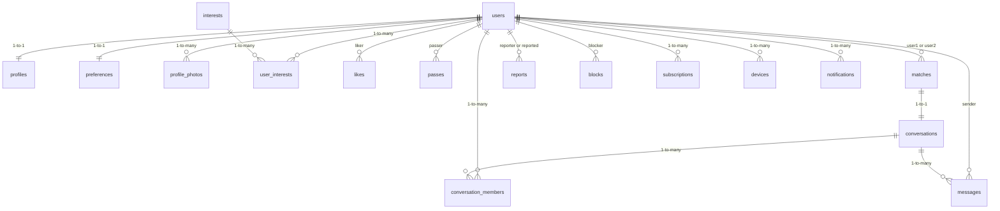

# Database Schema

All tables live in the `public` schema. Supabase Auth manages `auth.users`; a trigger auto-creates a `public.users` row on sign-up.

## Entity Relationship

## Key design decisions

| Decision | Reason |
|---|---|
| UUID primary keys | Prevents enumeration attacks |
| Soft delete on users | GDPR data export / restore capability |
| `user1_id < user2_id` constraint on matches | Prevents duplicate match rows |
| Age computed STORED column | Server-side age — client cannot falsify |
| Location as PostGIS GEOGRAPHY | Enables fast ST_DWithin proximity queries |
| RLS on all tables | Zero-trust: every query authorised at DB level |
| `likes` idempotent via UNIQUE(liker, liked) | Prevents duplicate likes from retries |
| notification_queue separate from notifications | Queue = pending send; notifications = user inbox |

## Tables

### users
Extends `auth.users`. Created automatically by trigger.

| Column | Type | Notes |
|---|---|---|
| id | uuid | FK → auth.users |
| email | text | |
| role | user_role | user / moderator / support / analyst / super_admin |
| onboarding_complete | boolean | False until onboarding finishes |
| is_suspended | boolean | Temporary restriction |
| suspend_until | timestamptz | When suspension lifts |
| is_banned | boolean | Permanent ban |
| ban_reason | text | Filled by admin |
| deleted_at | timestamptz | Soft delete |

### profiles

| Column | Type | Notes |
|---|---|---|
| id | uuid | FK → users |
| first_name | text | |
| date_of_birth | date | Never exposed to other users as-is |
| age | int | GENERATED ALWAYS — computed from DOB |
| gender | gender enum | |
| bio | text | Max 500 chars |
| location | geography(point) | PostGIS; never sent as exact coords |
| relationship_intent | relationship_intent enum | |

### matches

| Column | Type | Notes |
|---|---|---|
| id | uuid | |
| user1_id | uuid | Always the smaller UUID |
| user2_id | uuid | Always the larger UUID |
| conversation_id | uuid | FK → conversations |
| is_unmatched | boolean | Soft unmatch |
| UNIQUE(user1_id, user2_id) | constraint | Prevents duplicates |

### messages

| Column | Type | Notes |
|---|---|---|
| id | uuid | |
| conversation_id | uuid | |
| sender_id | uuid | |
| content | text | Blank if deleted |
| message_type | message_type enum | text / image / gif |
| is_deleted | boolean | Soft delete — content blanked |
